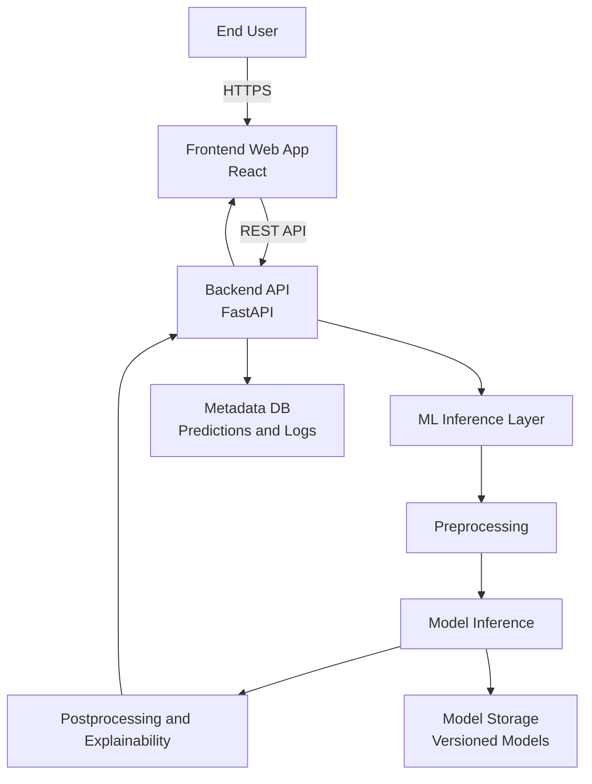

# CXR-Detect

Chest X-ray Disease Detection System using Deep Learning.

## Problem Statement
Early detection of diseases from chest X-ray images.

## Objectives
- Build a reliable CNN-based disease detection model
- Provide an API for inference
- Follow professional ML & software engineering practices

## Tech Stack
- Python, PyTorch/TensorFlow
- FastAPI
- Docker
- GitHub Actions (planned)

## System Architecture

## Project Status
🚧 In progress
